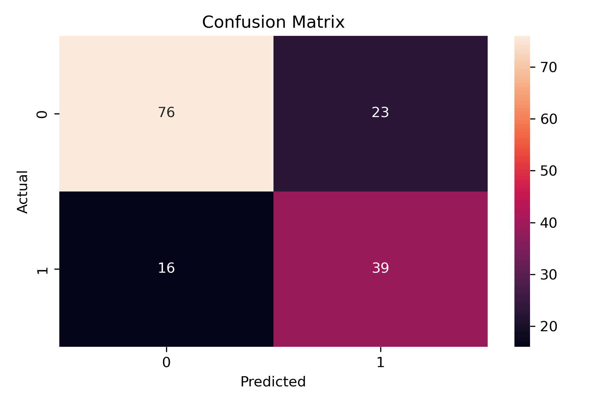

# Diabetes-Classification
In this project I tried to predict whether the patient has diabets or not in two different way: using a simple interpretable model(DecisionTreeClassifier) and using black box model (RandomForestClassifier). This open source dataset consists of 8 attributes and one label column Outcome

At first I did some EDA (exploratory data analysis) to get familiar with columns, checking the missing values.

## Distinct Values per Column
Pregnancies:17 distinct values
Glucose:136 distinct values
BloodPressure:47 distinct values
SkinThickness:51 distinct values
Insulin:186 distinct values
BMI:248 distinct values
DiabetesPedigreeFunction:517 distinct values
Age:52 distinct values
Outcome:2 distinct values

## Baseline: 
Majority class (label = 0). Since the data is imbalanced (34.9% no diabetes), we can have a simple baseline that predicts all data points in the test set as the majority class, in this case is label 0 (no diabetes). With baseline our confusion matrix looks like this:

## Baseline model evaluation

              precision    recall  f1-score   support

           0       0.64      1.00      0.78        99
           1       0.00      0.00      0.00        55

    accuracy                           0.64       154
   macro avg       0.32      0.50      0.39       154
weighted avg       0.41      0.64      0.50       154

## Decision Tree model evaluation

              precision    recall  f1-score   support

           0       0.83      0.77      0.80        99
           1       0.63      0.71      0.67        55

    accuracy                           0.75       154
   macro avg       0.73      0.74      0.73       154
weighted avg       0.76      0.75      0.75       154

We have 0.75 accuracy, which is better than the baseline majority guessing (0.64)

## Decision Tree visualization
As the decision tree is an interpretable model, it allows us to understand how it predicts an instance and the reasoning behind its decisions by examining the explanation tree. Here is how our result looks like:

